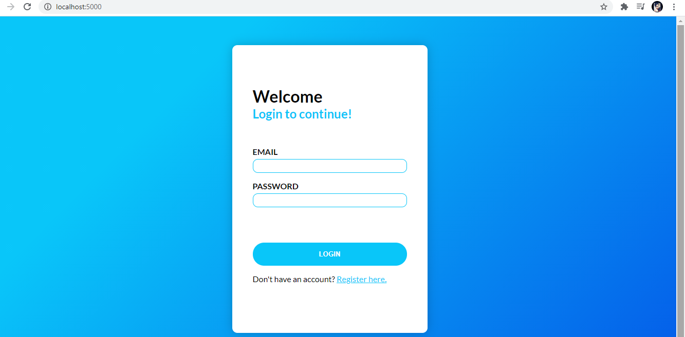
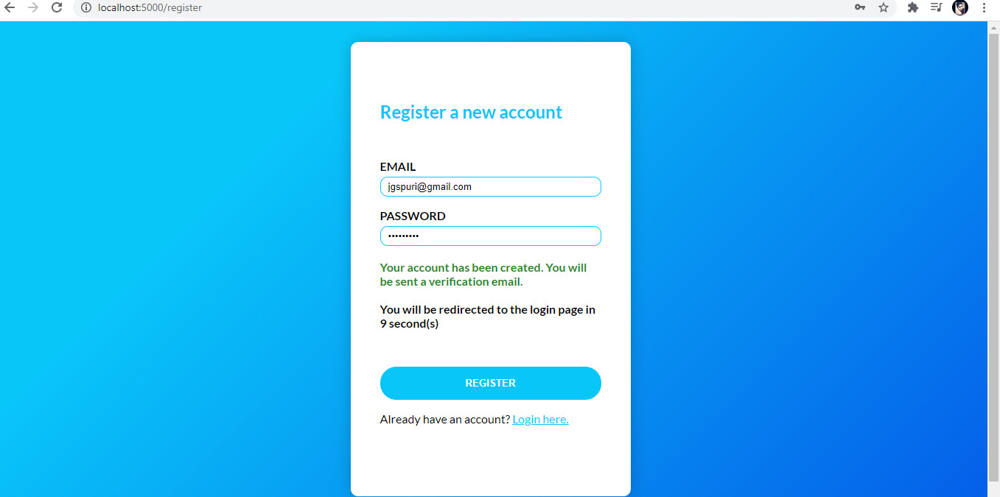
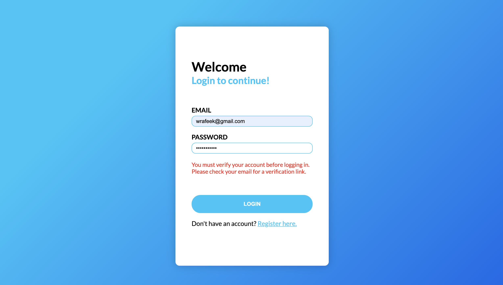
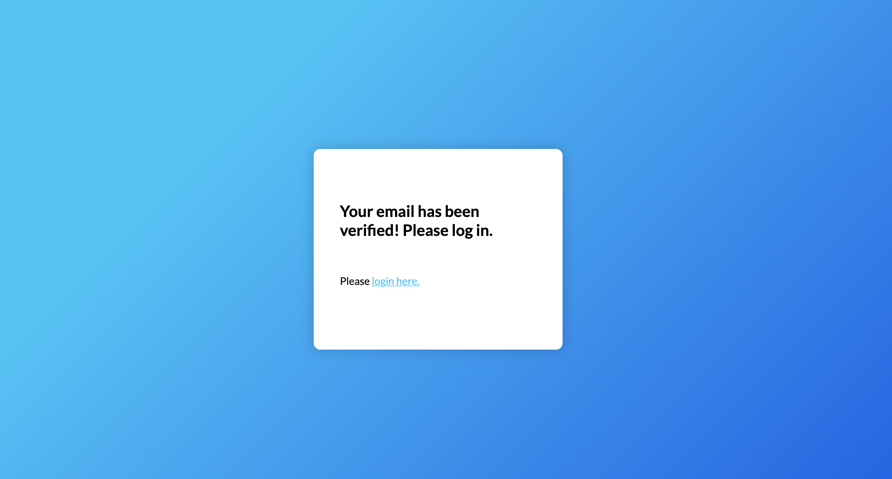
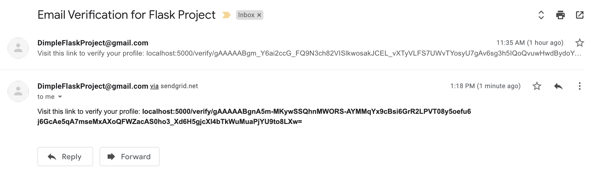
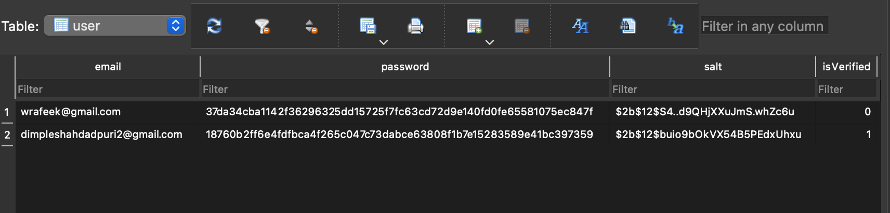

 # PythonLoginAndRegistrationProject
* I have created a Login and Registration page. 
* A user must first register with a valid email and password. Code on the backend validates the email address with regex and also checks that the password is a minimum of 8 characters, and contains at least 1 digit, 1 letter, and 1 special character.
 * After registration, we store the email, password, a generated salt value, and a boolean "isVerified" which defaults to false on our sqlite database.
 * An email is sent with SendGrid that contains a link to the verification endpoint with a token appended to the URL.
 * Finally, the user may login. If the user has registered but not verified themselves, a message will appear instructing them to do so. 
 * If the login is successful, the user is redirected to a page informing them of their success.  
 * STEPS TO RUN:
  1. Click on, "Docker-compose.yml"
  2. .env file needs to be places inside before running. 

 ### Screenshots:
 #### Login Page
 
 #### Registration Page
 
 #### Successfully Logged in 
 
 #### Account not verified 
 
 #### Email has been verified 
 
 

 #### Database
 

